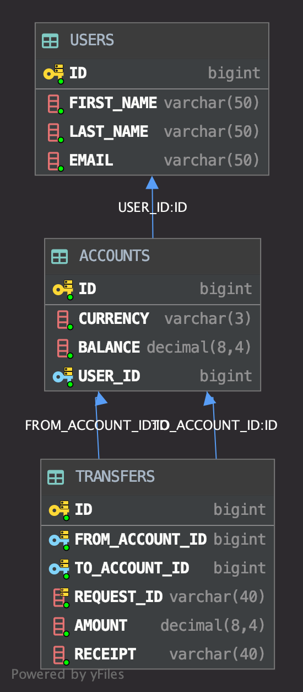

## simple-backend

## Features
* No Spring
* Web: lightweight [Ktor](https://ktor.io/) (on Netty runtime)
* Storage: in-memory H2. Used lightweight [Exposed](https://github.com/JetBrains/Exposed) for ORM
* Consistency is handled by DB transaction during transfer
* requestId used as idempotency key to handle network retries from the client

## Things I learnt

* Application startup time and memory footprint drastically decreased due to abscence of Spring. Horizontal scaling of microservice becomes faster and requires provisioning less memory. The need for shrinking Java app has come to my mind recently as our production Java apps become more of monolith than microservice. Fat Jar is about 19 MB in size. I showed that you can live without Spring's sugar when it comes to MVC and DI do develop simple microservice. Ktor has modular structure and can be extended with required features in the future. Exposed ORM is lightweight although has some learning curve.
 
 ## DB schema:
 
 

## TODO
* Split integration tests into unit + integration tests to comply with [testing pyramid](https://martinfowler.com/articles/practical-test-pyramid.html). Refactoring needed as there are quite some duplicates.
* For distributed microservices handling consistency by having single DB will become a bottleneck. Should utilize [orchestrated saga pattern](https://microservices.io/patterns/data/saga.html) to achieve consistency accross microservices. Although some RDBMS like PostgreSQL could notify Event Store apps about recent event, a hybrid solution might be the key.
* Error handling is done through exceptions. This is fine for small backend but for event-based microservice that has complex chains of calls having a large exception handler could be cumbersome. Better use functional approach and retrun `Result<Success, Error>` to determine root error cause easily.
* Business logic is oversimplified.

## Installation
```
./gradlew clean run
